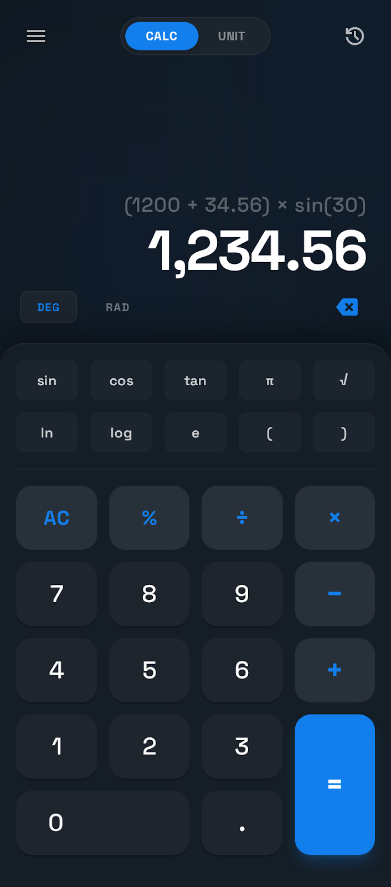
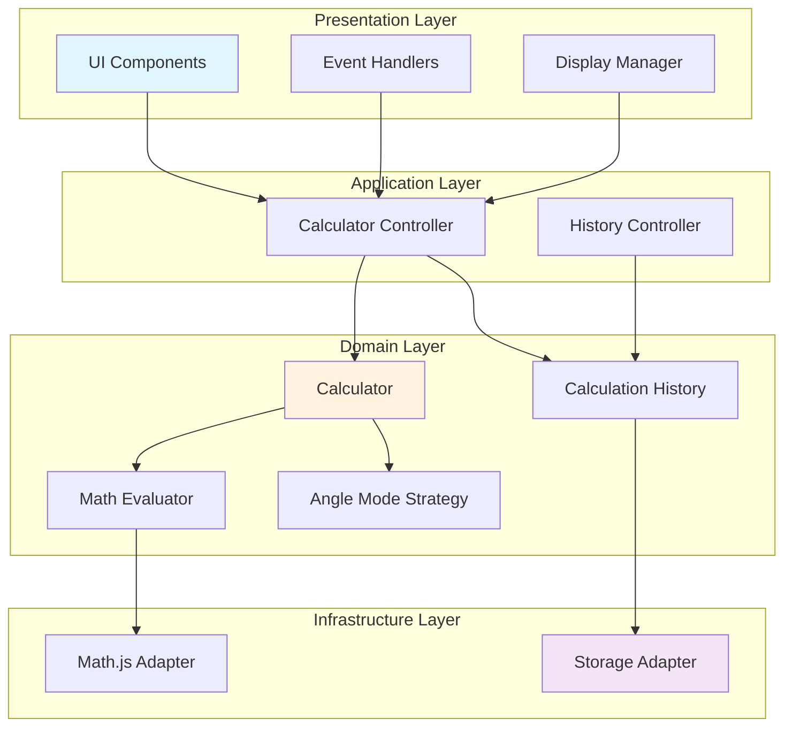
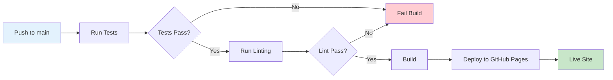
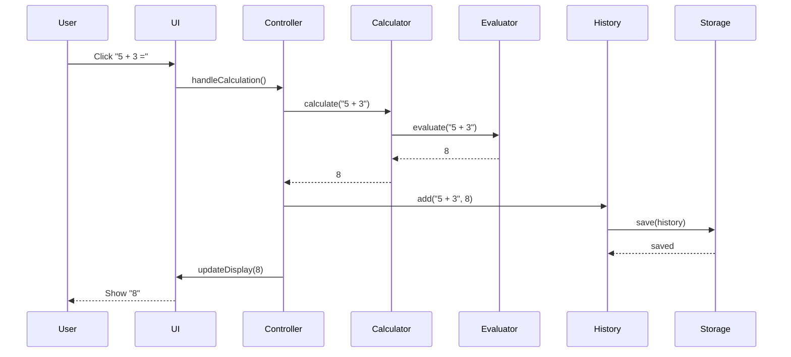
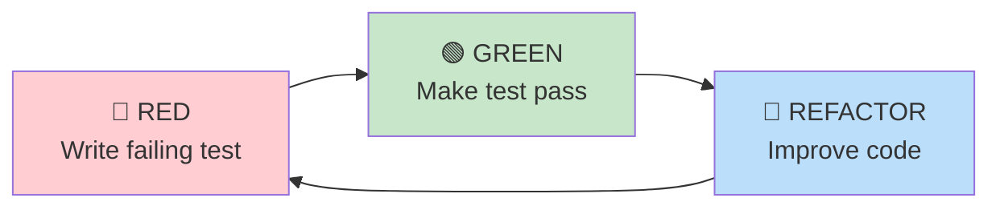
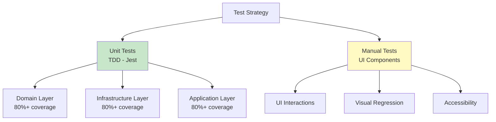

# 🧮 Scientific Calculator

[](https://github.com/megaTRX/calculator/actions/workflows/deploy.yml)
[](https://opensource.org/licenses/MIT)
[](https://standardjs.com)

> **A modern, enterprise-grade scientific calculator web application built with TDD and SOLID principles**

**🔗 Live Demo**: [https://megatrx.github.io/calculator/](https://megatrx.github.io/calculator/)



---

## 📋 Table of Contents

- [Overview](#-overview)
- [Key Features](#-key-features)
- [Technical Highlights](#-technical-highlights)
- [Architecture](#-architecture)
- [Technology Stack](#-technology-stack)
- [Development Principles](#-development-principles)
- [Getting Started](#-getting-started)
- [Project Structure](#-project-structure)
- [Testing](#-testing)
- [Deployment](#-deployment)
- [Documentation](#-documentation)
- [Contributing](#-contributing)
- [License](#-license)

---

## 🎯 Overview

This project is a **production-ready scientific calculator** web application that demonstrates professional software engineering practices. Built as a portfolio project, it showcases:

- ✅ **Test-Driven Development (TDD)** for all core business logic
- ✅ **SOLID principles** throughout the codebase
- ✅ **Clean Architecture** with clear separation of concerns
- ✅ **CI/CD pipeline** with automated testing and deployment
- ✅ **Accessibility-first** design (WCAG 2.1 Level AA compliant)
- ✅ **Modern UI/UX** with smooth animations and responsive design

### 🎓 Portfolio Context

This project was developed as part of my software engineering portfolio to demonstrate:
- Proficiency in modern JavaScript (ES6+) and web technologies
- Understanding of software architecture and design patterns
- Commitment to code quality through TDD and SOLID principles
- Ability to deliver production-ready applications with CI/CD
- Focus on user experience and accessibility

---

## ✨ Key Features

### Core Functionality
- 🔢 **Basic Arithmetic**: Addition, subtraction, multiplication, division, percentage
- 📐 **Scientific Functions**: Trigonometric (sin, cos, tan), logarithmic (ln, log), square root
- 🌡️ **Angle Modes**: DEG (degrees) and RAD (radians) support
- 📜 **Calculation History**: Persistent history with LocalStorage (up to 50 entries)
- ⌨️ **Keyboard Support**: Full keyboard shortcuts for efficient input
- 🎨 **Dark Mode**: Premium dark theme optimized for extended use

### User Experience
- ⚡ **Instant Calculations**: < 100ms response time
- 📱 **Fully Responsive**: Optimized for mobile, tablet, and desktop
- ♿ **Accessible**: ARIA labels, keyboard navigation, screen reader support
- 🎭 **Smooth Animations**: 60 FPS transitions and micro-interactions
- 💾 **State Persistence**: Maintains state across page refreshes

---

## 🏆 Technical Highlights

### 1. Test-Driven Development (TDD)

All core business logic is developed using strict TDD methodology:

```javascript
// Example: Calculator core logic test
describe('Calculator - Basic Operations', () => {
  test('should add two numbers correctly', () => {
    // Given
    calculator.input('5 + 3');
    
    // When
    const result = calculator.calculate();
    
    // Then
    expect(result).toBe(8);
  });
});
```

**Test Coverage**: 80%+ for all core logic (domain, infrastructure, application layers)

### 2. SOLID Principles Implementation

#### Single Responsibility Principle (S)
```javascript
// ✅ Each class has one responsibility
class Calculator {
  // Only handles calculation logic
}

class CalculationHistory {
  // Only handles history management
}

class LocalStorageAdapter {
  // Only handles storage operations
}
```

#### Open/Closed Principle (O)
```javascript
// ✅ Strategy pattern for extensibility
class AngleModeStrategy {
  convertAngle(angle) { /* ... */ }
}

class DegreeStrategy extends AngleModeStrategy {
  convertAngle(angle) {
    return math.unit(angle, 'deg');
  }
}

// Easy to add new modes without modifying existing code
class GradianStrategy extends AngleModeStrategy {
  convertAngle(angle) {
    return math.unit(angle, 'grad');
  }
}
```

#### Dependency Inversion Principle (D)
```javascript
// ✅ Depend on abstractions, not concretions
class Calculator {
  constructor(evaluator, storage) {
    this.evaluator = evaluator;  // IEvaluator interface
    this.storage = storage;        // IStorage interface
  }
}

// Easy to swap implementations for testing or different environments
const calculator = new Calculator(
  new MathJsAdapter(),      // Production evaluator
  new LocalStorageAdapter()  // Production storage
);

const testCalculator = new Calculator(
  new MockEvaluator(),  // Test evaluator
  new MemoryStorage()    // Test storage
);
```

### 3. Clean Architecture

The project follows a layered architecture with clear separation of concerns:



### 4. CI/CD Pipeline

Automated workflow with GitHub Actions:



---

## 🏗️ Architecture

### Layered Architecture

The application follows a **4-layer architecture** pattern:

```
┌─────────────────────────────────────────┐
│         Presentation Layer              │  ← UI, Events, Display
│  (No automated tests - manual only)     │
├─────────────────────────────────────────┤
│         Application Layer               │  ← Controllers, Use Cases
│  (TDD - 80%+ coverage)                  │
├─────────────────────────────────────────┤
│         Domain Layer                    │  ← Business Logic, Entities
│  (TDD - 80%+ coverage)                  │
├─────────────────────────────────────────┤
│         Infrastructure Layer            │  ← External Services, Adapters
│  (TDD - 80%+ coverage)                  │
└─────────────────────────────────────────┘
```

### Data Flow



### Design Patterns Used

1. **Strategy Pattern**: Angle mode conversion (DEG/RAD)
2. **Adapter Pattern**: Math.js and LocalStorage adapters
3. **Dependency Injection**: All dependencies injected through constructors
4. **Repository Pattern**: History storage abstraction
5. **Observer Pattern**: Event handling and UI updates

---

## 🛠️ Technology Stack

### Frontend
- **HTML5**: Semantic markup
- **CSS3**: Custom styling with Tailwind CSS
- **JavaScript (ES6+)**: Modern JavaScript with modules
- **Tailwind CSS**: Utility-first CSS framework
- **Math.js**: Precise mathematical calculations

### Development Tools
- **Jest**: Testing framework (80%+ coverage)
- **ESLint**: Code linting and quality
- **Babel**: JavaScript transpilation
- **GitHub Actions**: CI/CD automation
- **GitHub Pages**: Static site hosting

### External Libraries
- **Math.js** (v12.x): Mathematical expression evaluation
- **Google Fonts**: Space Grotesk typography
- **Material Symbols**: Icon library

---

## 💎 Development Principles

### Test-Driven Development (TDD)

**Red-Green-Refactor Cycle**:



**Coverage Requirements**:
- Domain Layer: 80%+
- Infrastructure Layer: 80%+
- Application Layer: 80%+
- Presentation Layer: Manual testing only

### SOLID Principles

| Principle | Implementation |
|-----------|----------------|
| **S**ingle Responsibility | Each class has one reason to change |
| **O**pen/Closed | Strategy pattern for extensibility |
| **L**iskov Substitution | All storage adapters interchangeable |
| **I**nterface Segregation | Small, focused interfaces |
| **D**ependency Inversion | Depend on abstractions via DI |

---

## 🚀 Getting Started

### Prerequisites

- Node.js 20.x or higher
- npm 8.x or higher
- Modern web browser

### Installation

```bash
# Clone the repository
git clone https://github.com/megaTRX/calculator.git
cd calculator

# Install dependencies
npm install

# Run development server
npm run dev
```

The application will be available at `http://localhost:3000`

### Development Commands

```bash
# Run tests
npm test

# Run tests in watch mode
npm run test:watch

# Generate coverage report
npm run test:coverage

# Run linting
npm run lint

# Fix linting errors
npm run lint:fix
```

---

## 📁 Project Structure

```
calculator/
├── .github/
│   └── workflows/
│       └── deploy.yml          # CI/CD pipeline
├── .agent/
│   └── rules/
│       ├── tdd.md              # TDD rules
│       └── solid.md            # SOLID principles
├── design/
│   ├── code.html               # Design reference
│   └── screen.png              # UI mockup
├── docs/
│   ├── PRD.md                  # Product Requirements
│   ├── TECH_SPEC.md            # Technical Specification
│   ├── DEVELOPMENT_GUIDE.md    # Development Guide
│   ├── IMPLEMENTATION_PLAN.md  # Implementation Plan
│   ├── GITHUB_ISSUES_TEMPLATE.md
│   └── CREATE_ISSUES_GUIDE.md
├── src/
│   ├── js/
│   │   ├── domain/             # Business logic (TDD)
│   │   │   ├── calculator/
│   │   │   ├── history/
│   │   │   └── unit-converter/
│   │   ├── infrastructure/     # External adapters (TDD)
│   │   │   ├── storage/
│   │   │   └── evaluator/
│   │   ├── application/        # Use cases (TDD)
│   │   ├── presentation/       # UI (Manual test)
│   │   └── main.js             # App entry point
│   └── css/
│       └── custom.css          # Custom styles
├── index.html                  # Main HTML
├── package.json                # Dependencies
├── babel.config.js             # Babel configuration
├── .eslintrc.js                # ESLint configuration
└── README.md                   # This file
```

---

## 🧪 Testing

### Test Strategy



### Running Tests

```bash
# Run all tests
npm test

# Run with coverage
npm run test:coverage

# Watch mode for TDD
npm run test:watch
```

### Test Examples

```javascript
// Domain Layer Test
describe('Calculator', () => {
  test('should handle complex expressions', () => {
    calculator.input('(5 + 3) * 2');
    expect(calculator.calculate()).toBe(16);
  });
});

// Infrastructure Layer Test
describe('LocalStorageAdapter', () => {
  test('should persist data correctly', () => {
    storage.save('key', { value: 42 });
    expect(storage.load('key')).toEqual({ value: 42 });
  });
});
```

---

## 🚢 Deployment

### Automated Deployment

The project uses **GitHub Actions** for continuous deployment:

1. **Trigger**: Push to `main` branch
2. **Test**: Run Jest tests (must pass)
3. **Lint**: Run ESLint (must pass)
4. **Build**: Prepare static files
5. **Deploy**: Deploy to GitHub Pages

### Manual Deployment

```bash
# Ensure all tests pass
npm test

# Ensure linting passes
npm run lint

# Commit and push to main
git add .
git commit -m "feat: your feature"
git push origin main

# GitHub Actions will automatically deploy
```

### Deployment URL

**Production**: https://megatrx.github.io/calculator/

---

## 📚 Documentation

Comprehensive documentation is available in the `docs/` directory:

| Document | Description |
|----------|-------------|
| [PRD.md](docs/PRD.md) | Product Requirements Document |
| [TECH_SPEC.md](docs/TECH_SPEC.md) | Technical Specification |
| [DEVELOPMENT_GUIDE.md](docs/DEVELOPMENT_GUIDE.md) | TDD & SOLID Guide |
| [IMPLEMENTATION_PLAN.md](docs/IMPLEMENTATION_PLAN.md) | Phase-by-phase Plan |

---

## 🤝 Contributing

This is a portfolio project, but suggestions and feedback are welcome!

### Development Workflow

1. Fork the repository
2. Create a feature branch (`git checkout -b feature/amazing-feature`)
3. **Write tests first** (TDD)
4. Implement the feature
5. Ensure all tests pass (`npm test`)
6. Ensure linting passes (`npm run lint`)
7. Commit your changes (`git commit -m 'feat: add amazing feature'`)
8. Push to the branch (`git push origin feature/amazing-feature`)
9. Open a Pull Request

### Commit Convention

```
<type>(<scope>): <subject>

<body>

<footer>
```

**Types**: `feat`, `fix`, `docs`, `style`, `refactor`, `test`, `chore`

---

## 📊 Project Metrics

- **Lines of Code**: ~2,000 (excluding tests)
- **Test Coverage**: 80%+ (core logic)
- **Lighthouse Score**: 90+ (all categories)
- **Bundle Size**: < 500KB (minified + gzipped)
- **Load Time**: < 2 seconds (3G connection)

---

## 🎓 Learning Outcomes

This project demonstrates proficiency in:

### Software Engineering
- ✅ Test-Driven Development (TDD)
- ✅ SOLID principles and design patterns
- ✅ Clean Architecture
- ✅ Dependency Injection
- ✅ Code quality and maintainability

### Web Development
- ✅ Modern JavaScript (ES6+)
- ✅ Responsive design
- ✅ Web accessibility (WCAG 2.1)
- ✅ Performance optimization
- ✅ Browser compatibility

### DevOps
- ✅ CI/CD with GitHub Actions
- ✅ Automated testing
- ✅ Automated deployment
- ✅ Version control (Git)

---

## 📝 License

This project is licensed under the MIT License - see the [LICENSE](LICENSE) file for details.

---

## 👨‍💻 Author

**Your Name**
- GitHub: [@megaTRX](https://github.com/megaTRX)
- Portfolio: [Your Portfolio URL]
- LinkedIn: [Your LinkedIn]

---

## 🙏 Acknowledgments

- Design inspiration from modern calculator applications
- Math.js library for precise calculations
- Tailwind CSS for rapid UI development
- Jest for excellent testing experience

---

<div align="center">

**⭐ If you found this project helpful, please consider giving it a star!**

Made with ❤️ using TDD and SOLID principles

</div>
