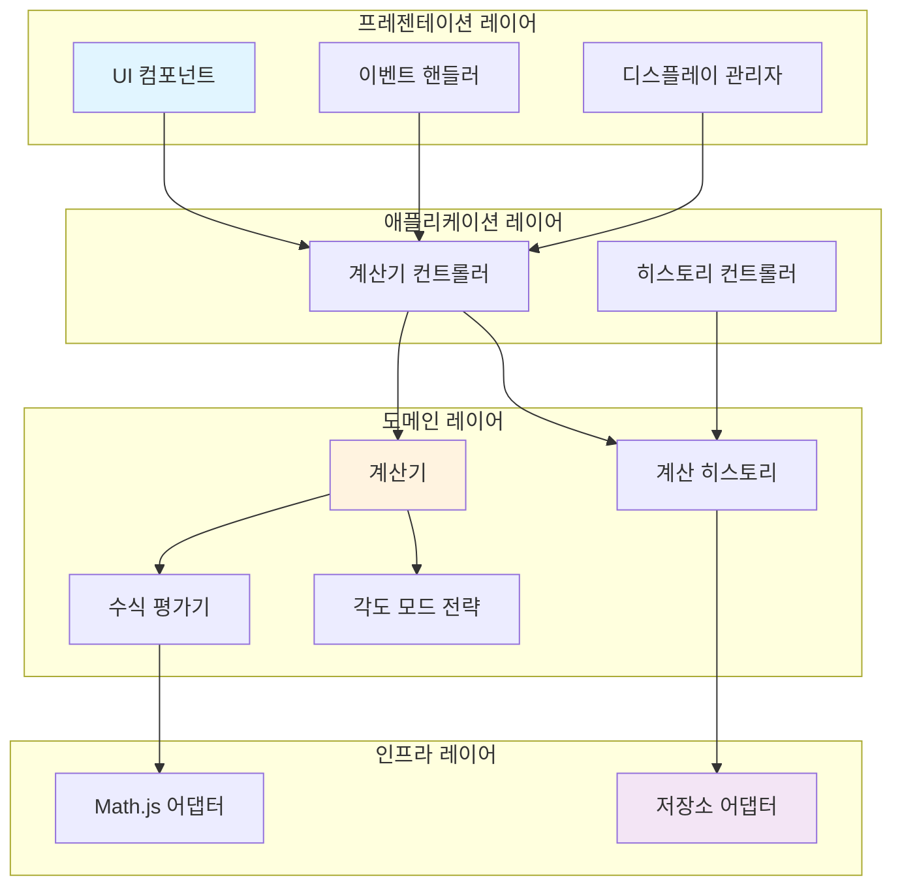
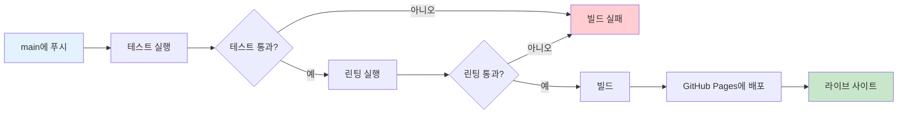
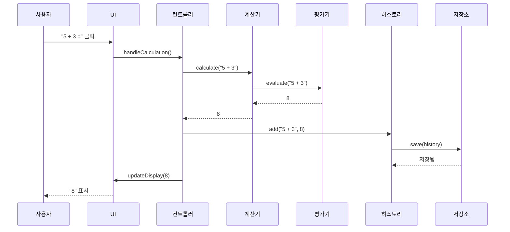
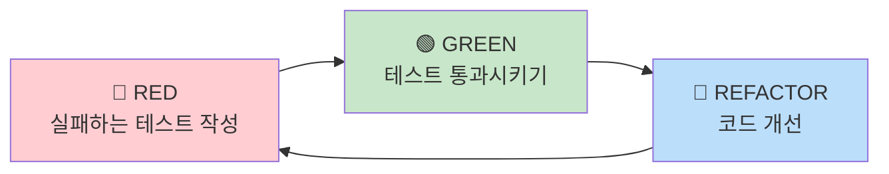
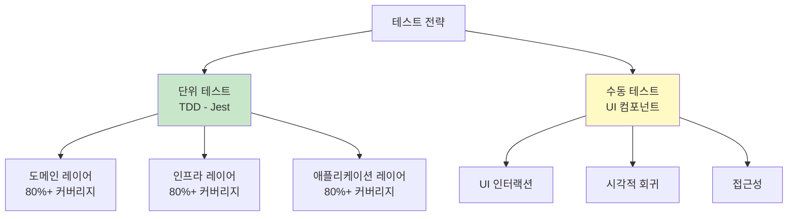

# 🧮 공학용 계산기 (Scientific Calculator)

[](https://github.com/megaTRX/calculator/actions/workflows/deploy.yml)
[](https://opensource.org/licenses/MIT)
[](https://standardjs.com)

> **TDD와 SOLID 원칙으로 구축한 현대적이고 엔터프라이즈급 공학용 계산기 웹 애플리케이션**

**🔗 라이브 데모**: [https://megatrx.github.io/calculator/](https://megatrx.github.io/calculator/)


---

## 📋 목차

- [개요](#-개요)
- [주요 기능](#-주요-기능)
- [기술적 하이라이트](#-기술적-하이라이트)
- [아키텍처](#-아키텍처)
- [기술 스택](#-기술-스택)
- [개발 원칙](#-개발-원칙)
- [시작하기](#-시작하기)
- [프로젝트 구조](#-프로젝트-구조)
- [테스팅](#-테스팅)
- [배포](#-배포)
- [문서](#-문서)
- [기여하기](#-기여하기)
- [라이선스](#-라이선스)

---

## 🎯 개요

이 프로젝트는 전문적인 소프트웨어 엔지니어링 실무를 보여주는 **프로덕션 레디 공학용 계산기** 웹 애플리케이션입니다. 포트폴리오 프로젝트로 제작되었으며, 다음을 시연합니다:

- ✅ 모든 핵심 비즈니스 로직에 **테스트 주도 개발(TDD)** 적용
- ✅ 코드베이스 전반에 걸친 **SOLID 원칙** 준수
- ✅ 명확한 관심사 분리를 가진 **클린 아키텍처**
- ✅ 자동화된 테스팅과 배포를 위한 **CI/CD 파이프라인**
- ✅ **접근성 우선** 디자인 (WCAG 2.1 Level AA 준수)
- ✅ 부드러운 애니메이션과 반응형 디자인의 **현대적 UI/UX**

### 🎓 포트폴리오 맥락

이 프로젝트는 다음을 입증하기 위한 소프트웨어 엔지니어링 포트폴리오의 일부로 개발되었습니다:
- 현대적인 JavaScript(ES6+)와 웹 기술에 대한 숙련도
- 소프트웨어 아키텍처와 디자인 패턴에 대한 이해
- TDD와 SOLID 원칙을 통한 코드 품질에 대한 헌신
- CI/CD를 갖춘 프로덕션 레디 애플리케이션 제공 능력
- 사용자 경험과 접근성에 대한 집중

---

## ✨ 주요 기능

### 핵심 기능
- 🔢 **기본 산술 연산**: 덧셈, 뺄셈, 곱셈, 나눗셈, 백분율
- 📐 **과학 함수**: 삼각함수(sin, cos, tan), 로그함수(ln, log), 제곱근
- 🌡️ **각도 모드**: DEG(도)와 RAD(라디안) 지원
- 📜 **계산 히스토리**: LocalStorage를 사용한 영구 히스토리 (최대 50개 항목)
- ⌨️ **키보드 지원**: 효율적인 입력을 위한 전체 키보드 단축키
- 🎨 **다크 모드**: 장시간 사용에 최적화된 프리미엄 다크 테마

### 사용자 경험
- ⚡ **즉각적인 계산**: < 100ms 응답 시간
- 📱 **완전 반응형**: 모바일, 태블릿, 데스크톱에 최적화
- ♿ **접근성**: ARIA 레이블, 키보드 탐색, 스크린 리더 지원
- 🎭 **부드러운 애니메이션**: 60 FPS 전환 및 마이크로 인터랙션
- 💾 **상태 지속성**: 페이지 새로고침 간 상태 유지

---

## 🏆 기술적 하이라이트

### 1. 테스트 주도 개발 (TDD)

모든 핵심 비즈니스 로직은 엄격한 TDD 방법론을 사용하여 개발되었습니다:

```javascript
// 예시: Calculator 핵심 로직 테스트
describe('Calculator - 기본 연산', () => {
  test('두 숫자를 올바르게 더해야 함', () => {
    // Given
    calculator.input('5 + 3');
    
    // When
    const result = calculator.calculate();
    
    // Then
    expect(result).toBe(8);
  });
});
```

**테스트 커버리지**: 모든 핵심 로직(도메인, 인프라, 애플리케이션 레이어)에 대해 80% 이상

### 2. SOLID 원칙 구현

#### 단일 책임 원칙 (S)
```javascript
// ✅ 각 클래스는 하나의 책임만 가짐
class Calculator {
  // 계산 로직만 처리
}

class CalculationHistory {
  // 히스토리 관리만 처리
}

class LocalStorageAdapter {
  // 저장소 작업만 처리
}
```

#### 개방-폐쇄 원칙 (O)
```javascript
// ✅ 확장성을 위한 전략 패턴
class AngleModeStrategy {
  convertAngle(angle) { /* ... */ }
}

class DegreeStrategy extends AngleModeStrategy {
  convertAngle(angle) {
    return math.unit(angle, 'deg');
  }
}

// 기존 코드 수정 없이 새로운 모드 추가 가능
class GradianStrategy extends AngleModeStrategy {
  convertAngle(angle) {
    return math.unit(angle, 'grad');
  }
}
```

#### 의존성 역전 원칙 (D)
```javascript
// ✅ 구체적인 것이 아닌 추상화에 의존
class Calculator {
  constructor(evaluator, storage) {
    this.evaluator = evaluator;  // IEvaluator 인터페이스
    this.storage = storage;        // IStorage 인터페이스
  }
}

// 테스트나 다른 환경을 위해 구현체를 쉽게 교체 가능
const calculator = new Calculator(
  new MathJsAdapter(),      // 프로덕션 평가기
  new LocalStorageAdapter()  // 프로덕션 저장소
);

const testCalculator = new Calculator(
  new MockEvaluator(),  // 테스트 평가기
  new MemoryStorage()    // 테스트 저장소
);
```

### 3. 클린 아키텍처

프로젝트는 명확한 관심사 분리를 가진 레이어드 아키텍처를 따릅니다:



### 4. CI/CD 파이프라인

GitHub Actions를 사용한 자동화된 워크플로우:



---

## 🏗️ 아키텍처

### 레이어드 아키텍처

애플리케이션은 **4-레이어 아키텍처** 패턴을 따릅니다:

```
┌─────────────────────────────────────────┐
│         프레젠테이션 레이어              │  ← UI, 이벤트, 디스플레이
│  (자동화 테스트 없음 - 수동만)          │
├─────────────────────────────────────────┤
│         애플리케이션 레이어              │  ← 컨트롤러, 유스케이스
│  (TDD - 80%+ 커버리지)                  │
├─────────────────────────────────────────┤
│         도메인 레이어                    │  ← 비즈니스 로직, 엔티티
│  (TDD - 80%+ 커버리지)                  │
├─────────────────────────────────────────┤
│         인프라 레이어                    │  ← 외부 서비스, 어댑터
│  (TDD - 80%+ 커버리지)                  │
└─────────────────────────────────────────┘
```

### 데이터 플로우



### 사용된 디자인 패턴

1. **전략 패턴**: 각도 모드 변환 (DEG/RAD)
2. **어댑터 패턴**: Math.js 및 LocalStorage 어댑터
3. **의존성 주입**: 생성자를 통한 모든 의존성 주입
4. **저장소 패턴**: 히스토리 저장소 추상화
5. **옵저버 패턴**: 이벤트 처리 및 UI 업데이트

---

## 🛠️ 기술 스택

### 프론트엔드
- **HTML5**: 시맨틱 마크업
- **CSS3**: Tailwind CSS를 사용한 커스텀 스타일링
- **JavaScript (ES6+)**: 모듈을 사용한 현대적 JavaScript
- **Tailwind CSS**: 유틸리티 우선 CSS 프레임워크
- **Math.js**: 정밀한 수학 계산

### 개발 도구
- **Jest**: 테스팅 프레임워크 (80%+ 커버리지)
- **ESLint**: 코드 린팅 및 품질
- **Babel**: JavaScript 트랜스파일레이션
- **GitHub Actions**: CI/CD 자동화
- **GitHub Pages**: 정적 사이트 호스팅

### 외부 라이브러리
- **Math.js** (v12.x): 수학 표현식 평가
- **Google Fonts**: Space Grotesk 타이포그래피
- **Material Symbols**: 아이콘 라이브러리

---

## 💎 개발 원칙

### 테스트 주도 개발 (TDD)

**Red-Green-Refactor 사이클**:



**커버리지 요구사항**:
- 도메인 레이어: 80%+
- 인프라 레이어: 80%+
- 애플리케이션 레이어: 80%+
- 프레젠테이션 레이어: 수동 테스트만

### SOLID 원칙

| 원칙 | 구현 |
|------|------|
| **S**ingle Responsibility | 각 클래스는 변경의 이유가 하나 |
| **O**pen/Closed | 확장성을 위한 전략 패턴 |
| **L**iskov Substitution | 모든 저장소 어댑터 상호 교환 가능 |
| **I**nterface Segregation | 작고 집중된 인터페이스 |
| **D**ependency Inversion | DI를 통한 추상화 의존 |

---

## 🚀 시작하기

### 필수 요구사항

- Node.js 20.x 이상
- npm 8.x 이상
- 최신 웹 브라우저

### 설치

```bash
# 저장소 클론
git clone https://github.com/megaTRX/calculator.git
cd calculator

# 의존성 설치
npm install

# 개발 서버 실행
npm run dev
```

애플리케이션은 `http://localhost:3000`에서 사용 가능합니다

### 개발 명령어

```bash
# 테스트 실행
npm test

# Watch 모드로 테스트 실행
npm run test:watch

# 커버리지 리포트 생성
npm run test:coverage

# 린팅 실행
npm run lint

# 린팅 오류 수정
npm run lint:fix
```

---

## 📁 프로젝트 구조

```
calculator/
├── .github/
│   └── workflows/
│       └── deploy.yml          # CI/CD 파이프라인
├── .agent/
│   └── rules/
│       ├── tdd.md              # TDD 규칙
│       └── solid.md            # SOLID 원칙
├── design/
│   ├── code.html               # 디자인 참조
│   └── screen.png              # UI 목업
├── docs/
│   ├── PRD.md                  # 제품 요구사항
│   ├── TECH_SPEC.md            # 기술 명세
│   ├── DEVELOPMENT_GUIDE.md    # 개발 가이드
│   ├── IMPLEMENTATION_PLAN.md  # 구현 계획
│   ├── GITHUB_ISSUES_TEMPLATE.md
│   └── CREATE_ISSUES_GUIDE.md
├── src/
│   ├── js/
│   │   ├── domain/             # 비즈니스 로직 (TDD)
│   │   │   ├── calculator/
│   │   │   ├── history/
│   │   │   └── unit-converter/
│   │   ├── infrastructure/     # 외부 어댑터 (TDD)
│   │   │   ├── storage/
│   │   │   └── evaluator/
│   │   ├── application/        # 유스케이스 (TDD)
│   │   ├── presentation/       # UI (수동 테스트)
│   │   └── main.js             # 앱 진입점
│   └── css/
│       └── custom.css          # 커스텀 스타일
├── index.html                  # 메인 HTML
├── package.json                # 의존성
├── babel.config.js             # Babel 설정
├── .eslintrc.js                # ESLint 설정
└── README.md                   # 이 파일
```

---

## 🧪 테스팅

### 테스트 전략



### 테스트 실행

```bash
# 모든 테스트 실행
npm test

# 커버리지와 함께 실행
npm run test:coverage

# TDD를 위한 Watch 모드
npm run test:watch
```

### 테스트 예시

```javascript
// 도메인 레이어 테스트
describe('Calculator', () => {
  test('복잡한 표현식을 처리해야 함', () => {
    calculator.input('(5 + 3) * 2');
    expect(calculator.calculate()).toBe(16);
  });
});

// 인프라 레이어 테스트
describe('LocalStorageAdapter', () => {
  test('데이터를 올바르게 유지해야 함', () => {
    storage.save('key', { value: 42 });
    expect(storage.load('key')).toEqual({ value: 42 });
  });
});
```

---

## 🚢 배포

### 자동화된 배포

프로젝트는 지속적 배포를 위해 **GitHub Actions**를 사용합니다:

1. **트리거**: `main` 브랜치에 푸시
2. **테스트**: Jest 테스트 실행 (통과 필수)
3. **린트**: ESLint 실행 (통과 필수)
4. **빌드**: 정적 파일 준비
5. **배포**: GitHub Pages에 배포

### 수동 배포

```bash
# 모든 테스트 통과 확인
npm test

# 린팅 통과 확인
npm run lint

# main에 커밋 및 푸시
git add .
git commit -m "feat: your feature"
git push origin main

# GitHub Actions가 자동으로 배포
```

### 배포 URL

**프로덕션**: https://megatrx.github.io/calculator/

---

## 📚 문서

`docs/` 디렉토리에서 포괄적인 문서를 확인할 수 있습니다:

| 문서 | 설명 |
|------|------|
| [PRD.md](docs/PRD.md) | 제품 요구사항 문서 |
| [TECH_SPEC.md](docs/TECH_SPEC.md) | 기술 명세서 |
| [DEVELOPMENT_GUIDE.md](docs/DEVELOPMENT_GUIDE.md) | TDD & SOLID 가이드 |
| [IMPLEMENTATION_PLAN.md](docs/IMPLEMENTATION_PLAN.md) | 단계별 계획 |

---

## 🤝 기여하기

이것은 포트폴리오 프로젝트이지만, 제안과 피드백은 언제나 환영합니다!

### 개발 워크플로우

1. 저장소 포크
2. 기능 브랜치 생성 (`git checkout -b feature/amazing-feature`)
3. **테스트 먼저 작성** (TDD)
4. 기능 구현
5. 모든 테스트 통과 확인 (`npm test`)
6. 린팅 통과 확인 (`npm run lint`)
7. 변경사항 커밋 (`git commit -m 'feat: add amazing feature'`)
8. 브랜치에 푸시 (`git push origin feature/amazing-feature`)
9. Pull Request 열기

### 커밋 컨벤션

```
<type>(<scope>): <subject>

<body>

<footer>
```

**Types**: `feat`, `fix`, `docs`, `style`, `refactor`, `test`, `chore`

---

## 📊 프로젝트 메트릭스

- **코드 라인 수**: ~2,000 (테스트 제외)
- **테스트 커버리지**: 80%+ (핵심 로직)
- **Lighthouse 점수**: 90+ (모든 카테고리)
- **번들 크기**: < 500KB (축소 + gzip)
- **로드 시간**: < 2초 (3G 연결)

---

## 🎓 학습 성과

이 프로젝트는 다음에 대한 숙련도를 보여줍니다:

### 소프트웨어 엔지니어링
- ✅ 테스트 주도 개발 (TDD)
- ✅ SOLID 원칙 및 디자인 패턴
- ✅ 클린 아키텍처
- ✅ 의존성 주입
- ✅ 코드 품질 및 유지보수성

### 웹 개발
- ✅ 현대적 JavaScript (ES6+)
- ✅ 반응형 디자인
- ✅ 웹 접근성 (WCAG 2.1)
- ✅ 성능 최적화
- ✅ 브라우저 호환성

### DevOps
- ✅ GitHub Actions를 사용한 CI/CD
- ✅ 자동화된 테스팅
- ✅ 자동화된 배포
- ✅ 버전 관리 (Git)

---

## 📝 라이선스

이 프로젝트는 MIT 라이선스에 따라 라이선스가 부여됩니다 - 자세한 내용은 [LICENSE](LICENSE) 파일을 참조하세요.

---

## 👨‍💻 작성자

**Your Name**
- GitHub: [@megaTRX](https://github.com/megaTRX)
- Portfolio: [Your Portfolio URL]
- LinkedIn: [Your LinkedIn]

---

## 🙏 감사의 말

- 현대적인 계산기 애플리케이션에서 디자인 영감을 받음
- 정밀한 계산을 위한 Math.js 라이브러리
- 빠른 UI 개발을 위한 Tailwind CSS
- 훌륭한 테스팅 경험을 위한 Jest

---

<div align="center">

**⭐ 이 프로젝트가 도움이 되었다면 스타를 눌러주세요!**

TDD와 SOLID 원칙으로 ❤️를 담아 제작

</div>
